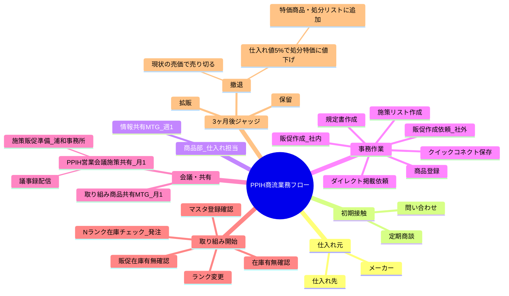

# PPIH商流業務フロー マインドマップ作成仕様書

> **バージョン:** 1.0
> **作成日:** 2026年3月19日
> **対象ツール:** Microsoft Visio（M365版）

---

## 1. 概要・目的

### 1.1 ドキュメントの目的
本仕様書は、PPIH商品部における商流業務フローを視覚化するマインドマップを、Microsoft Visioで作成するための要件を定義するものである。

### 1.2 対象読者
- 商品部 仕入れ担当者
- 業務フロー学習・引継ぎ担当者
- プロセス改善担当者

### 1.3 スコープ
メーカー・仕入れ先からの取り組み開始〜3ヶ月後のジャッジまでの業務フローを対象とする。

---

## 2. ツール要件

| 項目 | 仕様 |
|------|------|
| 使用ツール | Microsoft Visio Plan 2（M365版） |
| テンプレート | マインドマップテンプレート（標準搭載） |
| 保存形式 | .vsdx（Visio形式）+ PDF出力（配布用） |
| 互換性 | Visio in Microsoft 365 / Visio 2019以降 |

---

## 3. マインドマップ構造設計

### 3.1 中央ノード
**テキスト:** PPIH商流業務フロー

### 3.2 マインドマップ図（Mermaid形式）

### 3.3 階層構造詳細

| No. | ノード名 | 第2階層（詳細） |
|-----|----------|-----------------|
| 1 | 仕入れ元 | ・メーカー ・仕入れ先 |
| 2 | 初期接触 | ・定期商談 ・問い合わせ |
| 3 | 商品部（仕入れ担当） | ・情報共有MTG（週1） |
| 4 | 事務作業 | ・商品登録 ・ダイレクト掲載依頼 ・規定書作成 ・販促作成（社内） ・販促作成依頼（社外） ・クイックコネクト保存 ・施策リスト作成 |
| 5 | 会議・共有 | ・取り組み商品共有MTG（月1） ・PPIH営業会議施策共有（月1） 　　├ 議事録配信 　　└ 施策販促準備（浦和事務所） |
| 6 | 取り組み開始 | ・在庫有無確認 ・販促在庫有無確認 ・マスタ登録確認 ・Nランク在庫チェック、発注 ・ランク変更 |
| 7 | 3ヶ月後ジャッジ | ・拡販 ・保留 ・撤退 　　├ 現状の売価で売り切る 　　└ 仕入れ値5%で処分特価に値下げ 　　　　└【特価商品・処分リスト】に追加 |

---

## 4. スタイリングガイドライン

### 4.1 色分けルール

| フェーズ | 色 | カラーコード | 適用ノード |
|----------|-----|--------------|------------|
| 仕入れ元・初期接触 | 🔵 ブルー系 | `#4472C4` | 仕入れ元、初期接触 |
| 商品部・事務作業 | 🟢 グリーン系 | `#70AD47` | 商品部、事務作業 |
| 会議・共有 | 🟠 オレンジ系 | `#ED7D31` | 会議・共有 |
| 取り組み開始 | 🟡 イエロー系 | `#FFC000` | 取り組み開始 |
| ジャッジ・撤退 | 🔴 レッド系 | `#C00000` | 3ヶ月後ジャッジ |

### 4.2 フォント設定

| 要素 | フォント | サイズ | スタイル |
|------|----------|--------|----------|
| 中央ノード | メイリオ | 18pt | 太字 |
| 第1階層 | メイリオ | 14pt | 太字 |
| 第2階層 | メイリオ | 11pt | 標準 |
| 第3階層以下 | メイリオ | 10pt | 標準 |

### 4.3 コネクタ設定
- 種類: 直線コネクタ（矢印付き）
- 太さ: 2pt
- 色: 濃いグレー（`#404040`）

---

## 5. Visio作成手順

1. **Visio起動**
   Microsoft 365アプリ一覧から「Visio」を起動

2. **テンプレート選択**
   「新規作成」→ 検索欄に「マインドマップ」→「マインドマップ」テンプレートを選択

3. **中央ノード配置**
   キャンバス中央のメイントピックに「PPIH商流業務フロー」と入力

4. **第1階層ノード配置**
   中央ノードを選択→「トピックの追加」で7つの第1階層ノードを追加

5. **第2階層以降の詳細追加**
   各第1階層ノードを選択→「サブトピックの追加」で詳細を追加

6. **色分け適用**
   各ノードを選択→「図形の書式設定」→「塗りつぶし」で色を設定

7. **フォント設定**
   各階層のノードを選択→「ホーム」タブ→フォント設定を変更

8. **レイアウト調整**
   「マインドマップ」タブ→「レイアウト」→「放射状」を選択

9. **レビュー・修正**
   内容確認・調整

10. **保存**
    SharePointに保存: ファイル→名前を付けて保存→SharePointサイトを選択

11. **PDF出力**
    ファイル→エクスポート→PDF作成

---

## 6. 共有・コラボレーション設定

### 6.1 保存場所
- **推奨:** SharePointドキュメントライブラリ（商品部専用サイト）
- **代替:** Teamsチャネルの「ファイル」タブ

### 6.2 権限設定

| 権限レベル | 対象 | 内容 |
|------------|------|------|
| 編集権限 | 商品部メンバー | ファイルの編集・更新が可能 |
| 閲覧権限 | 全社員 | 閲覧のみ（PDF推奨配布） |

### 6.3 バージョン管理
- SharePointのバージョン履歴機能を有効化
- 更新時はコメントを記録
- 四半期ごとにバージョンを確定

---

## 7. メンテナンス方法

### 7.1 定期レビュー
- **頻度:** 四半期ごと（3ヶ月）
- **担当:** 商品部 仕入れ担当リーダー
- **内容:** フローの変更点確認・反映

### 7.2 変更時のルール
1. 変更内容をSharePointのバージョンコメントに記録
2. 変更後、PDFを再出力し配布
3. 関係者へ変更通知（Teams/メール）

### 7.3 更新履歴フォーマット

| 日付 | バージョン | 変更内容 | 変更者 |
|------|------------|----------|--------|
| 2026/03/19 | 1.0 | 初版作成 | （担当者名） |

---

> 本仕様書は PPIH商流業務フロー マインドマップ作成のために作成されました。
